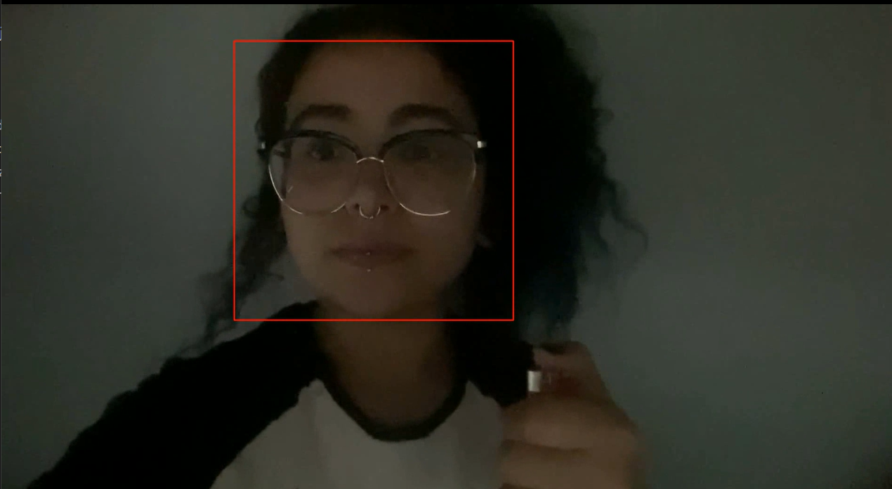

# Avaliação - Módulo 6 

## Objetivo

Desenvolver um código em Python capaz de utilizar o openCV para a leitura de um vídeo (frame a frame) e, para cada frame, o seu código deve identificar e marcar na imagem os retângulos correspondentes a cada uma das faces encontradas. Ao final do código, um novo vídeo deve ser salvo com a(s) face(s) identificada(s).

Para a detecção das faces, pode-se utilizar a abordagem que quiser (haar cascade, filtro de correlação, YOLO). Não há a necessidade de fazer o fine tuning da detecção. 

## Tecnologias Utilizadas 
-> Python 

-> OpenCV

## Execução

Para executar o código basta somente definir qual dos casos de teste irá realizar para a avaliação de rostos. 

Em seguida, estando dentro da pasta principal ``src`, basta executar:

`python3 edita_video.py`

## Estrutura de Arquivos 

Este repositório conta com dois códigos, uma pasta com opções de vídeo e uma biblioteca de identificação de imagens:

1. `reproduz_video.py` -> Leitura e reprodução de vídeo utilizando o opencv; 
2. `edita_video.py` -> Onde é possível ver como se abre um vídeo com o opencv e edita-o frame a frame, salvando um único arquivo de vídeo ao final.
3. `./assets` -> Vídeos possíveis para casos de teste do código 

## Casos de Teste 
 
 
